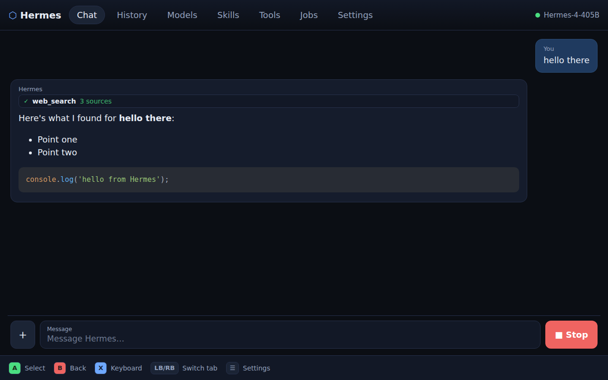

# Hermes for Steam Deck

A controller- and touch-first front end for the [Nous Research **Hermes
Agent**](https://github.com/NousResearch/hermes-agent) — designed to be fully
usable with the Steam Deck's built-in peripherals (thumbsticks, D-pad, ABXY,
trackpads, gyro, triggers, touchscreen, on-screen keyboard) with no mouse or
hardware keyboard required.

It talks to the Hermes Agent's **API Server** (OpenAI-compatible + REST), so you
get the agent's *full* functionality — streaming agentic turns with live tool
progress, interrupts, human tool-approval gates, persistent sessions, model
switching, skills/toolsets browsing, image input, and scheduled jobs — all from
a handheld, gamepad-driven UI.



## Why this exists

Hermes ships its own web dashboard, but it's a desktop/mouse admin panel. On the
Deck you want a **big, legible, controller-navigable** client. This app provides
exactly that, while exposing the agent's capabilities rather than just plain chat.

## Features

- **Agentic chat** with token streaming, inline **tool activity**, **Stop**
  (interrupt), and **Approve / Deny** gates when the agent asks to run a tool.
- **Markdown + syntax-highlighted code** rendering.
- **Image input** (attach pictures to a message).
- **Sessions / history** — server-side persistence: open, rename, fork, delete.
- **Model switcher** (`/v1/models`), **Skills** and **Toolsets** browsers.
- **Scheduled jobs** (natural-language cron): create, run now, pause/resume, delete.
- **Steam Deck input layer**: spatial (D-pad/stick) focus navigation with a gold
  focus ring, Gamepad API polling with auto-repeat, keyboard parity, a built-in
  **on-screen keyboard**, large touch targets, and a control-hints bar.
- **Configurable backend** — point it at Hermes running locally on the Deck
  (`http://127.0.0.1:8642`) or on a remote VPS/home server.

## Controls

| Control            | Action                         |
| ------------------ | ------------------------------ |
| D-pad / Left stick | Move focus                     |
| A                  | Select / activate              |
| B                  | Back / cancel / close keyboard |
| X                  | Open on-screen keyboard        |
| L1 / R1            | Switch tab                     |
| L2 / R2            | Scroll                         |
| Touch / trackpad   | Tap anything directly          |

## Quick start (dev, no agent needed)

```bash
npm install

# Terminal 1 — a mock Hermes API server (streams a fake agentic turn):
npm run mock

# Terminal 2 — the app:
npm run dev
```

Open the dev URL, go to **Settings**, set **API base URL** to
`http://127.0.0.1:8642` and any non-empty **API key**, then **Connect**. Send a
message; include the word `deploy` to see the tool-approval gate.

## Connect to a real Hermes Agent

1. Install Hermes: <https://hermes-agent.nousresearch.com/docs>.
2. Enable its API server — in `~/.hermes/.env`:
   ```bash
   API_SERVER_ENABLED=true
   API_SERVER_KEY=choose-a-secret
   # allow this app's origin so the browser can call the API:
   API_SERVER_CORS_ORIGINS=http://127.0.0.1:4173
   ```
   then start it with `hermes gateway`.
3. In the app's **Settings**, set the base URL (`http://127.0.0.1:8642` if Hermes
   runs on the Deck, otherwise `http://<host>:8642`) and the **API key**, and
   **Connect**.

The API key and connection settings are stored locally in the browser.

## Run on the Steam Deck

### Quick install (prebuilt, recommended)

In **Desktop Mode**, open Konsole and run:

```bash
curl -fsSL https://github.com/cangrew/hermes-steam-deck/raw/release/install.sh | bash
```

This downloads the latest prebuilt bundle to `~/Applications/hermes-deck`, adds a
**Hermes (Steam Deck)** entry to your app menu, and prints how to add it to Steam
for Gaming Mode. Launch it from the menu or
`~/Applications/hermes-deck/deck/launch-kiosk.sh`. Uninstall with
`~/Applications/hermes-deck/install.sh --uninstall`.

The app opens a normal closeable window; close it with the window's **X**, the
in-app **⏻ Quit** button (top-right / Settings), or **Alt+F4**.

### From source

Build it and add it as a non-Steam game so it launches in Gaming Mode with
controller support — the standard Steam Input **Gamepad** template works out of
the box. Full walkthrough: [`deck/add-non-steam-shortcut.md`](deck/add-non-steam-shortcut.md);
controller notes (and a keyboard+mouse fallback layout) in
[`deck/steam-input-layout.md`](deck/steam-input-layout.md).

```bash
npm run build
chmod +x deck/launch-kiosk.sh
./deck/launch-kiosk.sh        # serves ./dist and opens a window (KIOSK=1 for fullscreen)
```

## How it connects (API surface used)

| Capability        | Endpoint(s)                                                        |
| ----------------- | ----------------------------------------------------------------- |
| Connect/discovery | `GET /health`, `/v1/capabilities`, `/v1/models`                   |
| Agentic turn      | `POST /v1/runs` → `GET /v1/runs/{id}/events` (SSE)                 |
| Interrupt/approve | `POST /v1/runs/{id}/stop`, `POST /v1/runs/{id}/approval`          |
| Sessions/history  | `GET/POST/PATCH/DELETE /api/sessions/*`, `/messages`, `/fork`     |
| Browsers          | `GET /v1/skills`, `GET /v1/toolsets`                              |
| Jobs/cron         | `GET/POST/DELETE /api/jobs/*`, `/pause` `/resume` `/run`          |

Auth is `Authorization: Bearer <API_SERVER_KEY>`; an optional memory scope is
sent as `X-Hermes-Session-Key`. The streaming parser tolerates the differing SSE
shapes across the chat-completions / responses / runs endpoints.

## Project layout

```
src/api/        Typed Hermes client, tolerant SSE parser, types
src/state/      Zustand store (settings, connection, chat turn loop) + OSK store
src/input/      Spatial nav init, Gamepad polling, focusables, on-screen keyboard
src/components/ Top bar, hints bar, chat (bubbles/composer), markdown
src/screens/    Chat, History, Models, Skills, Toolsets, Jobs, Settings
mock/           Stand-in Hermes API server for development/testing
deck/           Kiosk launcher + Steam Deck setup guides
```

## Scripts

```bash
npm run dev        # Vite dev server
npm run build      # typecheck + production build
npm run preview    # serve the build
npm run mock       # mock Hermes API on :8642
npm run lint       # ESLint
npm test           # Vitest unit tests
npm run typecheck  # tsc --noEmit
```

## Tech

React 18 + TypeScript + Vite, Zustand, `@noriginmedia/norigin-spatial-navigation`,
`react-markdown` + `react-syntax-highlighter`. MIT-spirited; built to pair with
the MIT-licensed Hermes Agent.
